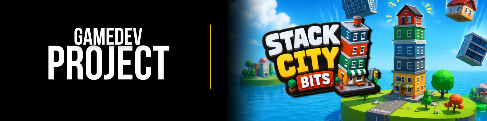

<div align="center">

  

  <br>

  <h1>🏙️ Stack City Bits</h1>

  <p>
    <strong>A casual stacking game made with Unity and C#.</strong>
  </p>

  <p>
    Build the tallest city you can by stacking houses and buildings<br>
    on a tiny island in the middle of nowhere!
  </p>

  <p>
    
    
    
    
  </p>

</div>

---

## 🎮 About

**Stack City Bits** is a casual physics-based stacking game developed with **Unity and C#**.

Buildings and houses fall from above, and your goal is simple:

> **Stack as many buildings as possible without letting your city collapse.**

Each new piece needs to be carefully positioned before being dropped onto the growing tower. As the city gets taller, keeping everything balanced becomes increasingly difficult.

The entire city is built on a small island floating in the middle of nowhere, creating a simple but charming environment for the stacking challenge.

---

## 🏗️ Gameplay

The core gameplay loop is straightforward:

1. 🏠 A new building appears above the island.
2. ↔️ Move the building to find the best position.
3. 📦 Drop it onto the existing structure.
4. 🏙️ Keep stacking and growing your city.
5. 🏆 Try to beat your previous score and climb the leaderboard.

The challenge comes from the physics of the buildings. A poorly positioned structure can make the entire tower unstable.

---

## ✨ Features

* 🏙️ **Physics-based building stacking**
* 🏠 Multiple houses and small buildings
* 🏝️ Floating island environment
* 📱 **Mobile controls**
* ⌨️ **Keyboard controls**
* 🏆 **Leaderboard system**
* 🚫 **Remove Ads option**
* 🎮 Simple and accessible gameplay
* 💥 Buildings affected by physics when dropped
* 📈 Endless stacking challenge

---

## 🎮 Controls

### 🖥️ PC

|   Key   | Action           |
| :-----: | ---------------- |
|   `W`   | Move piece       |
|   `A`   | Move piece left  |
|   `S`   | Move piece       |
|   `D`   | Move piece right |
| `SPACE` | Drop piece       |

> **Note:** The primary PC controls use `A` and `D` for horizontal movement, while `W` and `S` are available for movement depending on the current game state.

### 📱 Mobile

The game also includes **touch controls designed for mobile devices**, allowing players to move and drop the buildings directly through the touchscreen.

---

## 🏆 Leaderboard

Stack City Bits includes a **leaderboard system** where players can compare their scores and compete for the highest positions.

The goal is not only to build a tall city, but to build one **taller than everyone else's**.

---

## 🚫 Remove Ads

The game includes an optional **Remove Ads** feature for players who want to enjoy the game without advertisements.

---

## 🛠️ Built With

| Technology        | Usage                            |
| ----------------- | -------------------------------- |
| **Unity**         | Game engine                      |
| **C#**            | Gameplay and game systems        |
| **Unity Physics** | Building movement and collisions |
| **Unity UI**      | Menus, HUD and interface         |
| **Mobile Input**  | Touch controls                   |
| **Leaderboard**   | Score ranking system             |

---

## 🚧 Current Status

> 🟠 **In Development**

The game is currently **playable and functional**, but it is still under development.

There are some known bugs and rough edges that still need to be addressed. The current version should therefore be considered a **work in progress** rather than a final release.

Future development will focus on:

* 🐛 Fixing existing bugs
* ⚖️ Improving physics and building stability
* 📱 Improving mobile controls
* 🎨 Polishing the visuals
* 🔊 Improving audio and feedback
* 🏆 Improving the leaderboard experience
* 🚀 Performance improvements
* 📦 Adding more buildings and content

---

## 🐛 Known Issues

The current version contains some known bugs related to Leaderboard and Adds System.

These issues do not prevent the game from being played in general, but they may occasionally affect the experience.

As development continues, these problems will be tracked and fixed.

---

## 🚀 Getting Started

### Requirements

Before opening the project, make sure you have:

* **Unity Hub**
* A compatible **Unity version**
* **Git**
* A device or emulator if testing the mobile version

### Clone the repository

```bash
git clone <repository-url>
```

Then open the project through **Unity Hub**.

Select the project's root directory and allow Unity to import the required assets and packages.

---

## 📸 Screenshots

<div align="center">

  
  

</div>

---

## 🎯 Future Plans

Some ideas for future versions include:

* [ ] More building types
* [ ] New islands / environments
* [ ] Better building physics
* [ ] Improved mobile controls
* [ ] More visual effects
* [ ] Sound effects and music improvements
* [ ] Additional game modes
* [ ] Improved leaderboard
* [ ] More customization
* [ ] Bug fixing and optimization
* [ ] Final mobile release

---

## 👨‍💻 Development

Stack City Bits was created as a **Unity game development project**, with gameplay systems, controls and interactions implemented using **C#**.

The project is also being used to explore concepts such as:

* Physics-based gameplay
* Input systems
* Mobile game development
* UI/UX in Unity
* Leaderboard integration
* Monetization systems
* Game architecture
* Game feel and player feedback
* Programming with C#

---

## 📄 License

This project is currently being developed as a personal project.

License information will be added when the project is ready for distribution.

---

<div align="center">

  <h3>🏙️ Stack it. Balance it. Beat the leaderboard.</h3>

  <p>
    Made with <strong>Unity</strong> and <strong>C#</strong>.
  </p>

</div>
